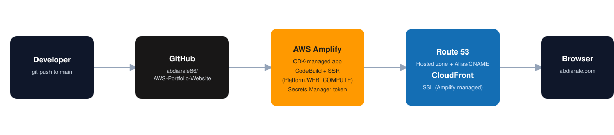

# Portfolio Website with AWS Amplify & Next.js

> **A cloud-native portfolio deployed with a fully automated CI/CD pipeline using Infrastructure as Code**

[](https://www.abdiarale.com)
[](https://aws.amazon.com/amplify/)
[](https://nextjs.org/)
[](https://www.typescriptlang.org/)

## 📋 Project Overview

This project is a production portfolio site built with Next.js and deployed on AWS Amplify Hosting, with all infrastructure defined and provisioned through AWS CDK. Every push to `main` triggers an automated build and deploy, and the site is served under a custom domain registered and routed through Route 53.

**🚨 📖 [View Full Documentation](DOCUMENTATION.md)** for the detailed step-by-step build. 🚨

## 🏗️ Architecture



**Workflow:** Next.js Application → GitHub Repository → AWS Amplify (Compute/SSR) → Route 53 + CloudFront → `abdiarale.com`

## 🚀 Key Features

- **Automated CI/CD Pipeline** - every push to `main` triggers a build and deploy via Amplify
- **Infrastructure as Code** - the entire Amplify app is defined in AWS CDK (TypeScript)
- **Server-Side Rendering** - runs on Amplify's `WEB_COMPUTE` platform, not a static export
- **Custom Domain** - `abdiarale.com` / `www.abdiarale.com` via Route 53, with Amplify-managed SSL
- **Secure Token Management** - GitHub access token pulled from AWS Secrets Manager
- **Build Caching** - `node_modules` and `.next/cache` cached between builds for faster deploys

## 🛠️ Technologies

| Category | Technologies |
|----------|-------------|
| **Frontend** | Next.js, TypeScript, Tailwind CSS |
| **Infrastructure** | AWS Amplify, AWS CDK, AWS Secrets Manager, IAM |
| **CI/CD** | GitHub, AWS CodeBuild (via Amplify) |
| **DNS / CDN** | Route 53, CloudFront |

## 💡 What I Learned

✅ Deploying Next.js SSR apps on AWS Amplify (and how it differs from static export)
✅ Defining Amplify apps declaratively with AWS CDK instead of the console
✅ Wiring up a custom domain end-to-end with Route 53 and Amplify-managed certificates
✅ Diagnosing production issues directly from CloudFront/S3 response headers
✅ Managing GitHub credentials securely with AWS Secrets Manager

## 📁 Project Structure

```
AWS-Portfolio-Website/
├── src/app/                       # Next.js application source
├── public/                        # Static assets
├── portfolio-infrastructure/       # AWS CDK code
│   ├── bin/                       # CDK app entry point
│   └── lib/                       # Amplify app stack definition
└── package.json                   # Dependencies
```

## 🔧 Key Implementation Highlights

### AWS CDK Infrastructure
- Amplify `App` construct connected directly to this GitHub repo
- Custom build spec for a Next.js SSR build (`baseDirectory: .next`)
- GitHub OAuth token pulled securely from Secrets Manager at deploy time

### Challenges Overcome
- ✅ Fixed a 404 on the custom domain caused by the Amplify app defaulting to static hosting (`Platform.WEB`) instead of SSR compute (`Platform.WEB_COMPUTE`)
- ✅ Diagnosed the issue directly from response headers (`server: AmazonS3`) rather than guessing at DNS
- ✅ Verified Route 53 alias/CNAME records against the Amplify domain association API

## 📚 Documentation

For the complete walkthrough — setup, CDK stack details, the domain configuration, and the SSR platform bug and fix — see [DOCUMENTATION.md](DOCUMENTATION.md).

## 🤝 Connect With Me

<div align="center">

[](mailto:abdijarale@gmail.com)
[](https://github.com/abdiarale86)

</div>

---

<div align="center">

**⭐ If you found this project helpful, please consider giving it a star!**

</div>
